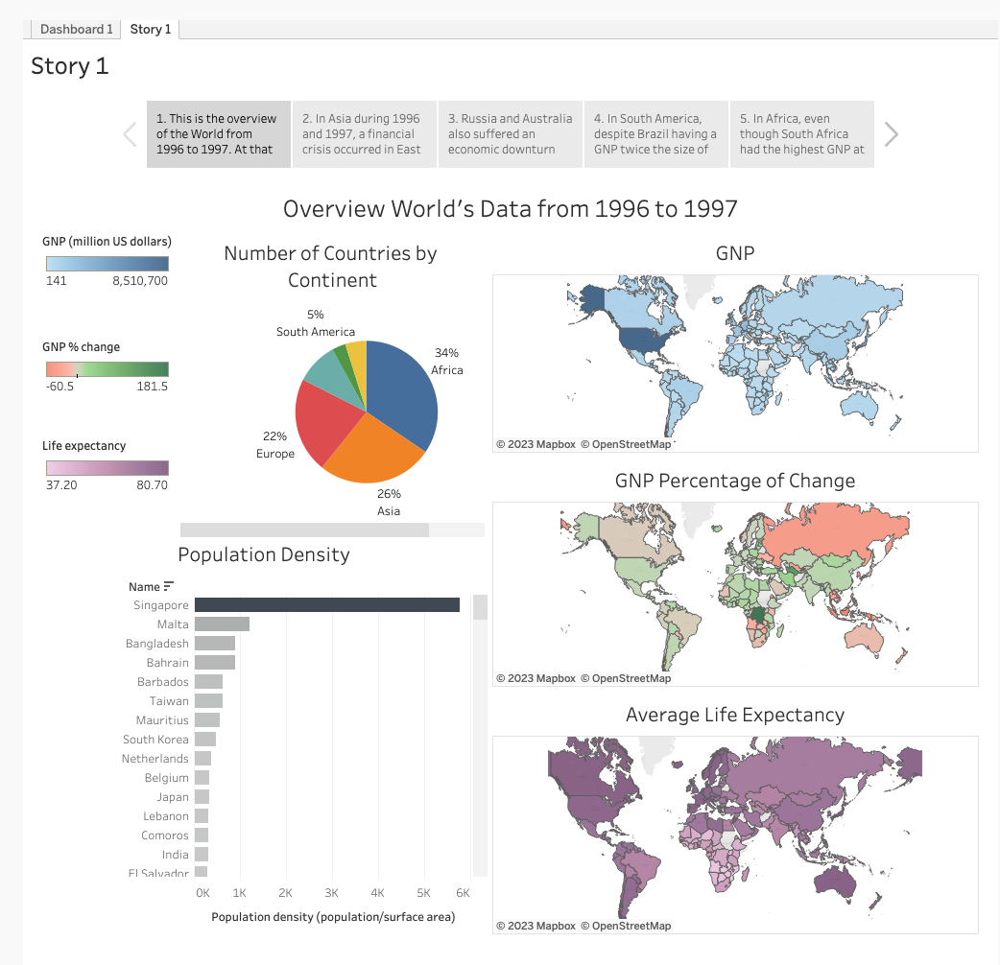

# Global Socioeconomic Overview from 1996 to 1997

https://public.tableau.com/app/profile/vincent.ho4408/viz/WorldData9697/Dashboard1

## Author

-   Vincent Ho

## Background

The world experienced significant changes in its socioeconomic landscape during the late 20th century. The years 1996 and 1997 were crucial periods marked by economic growth, political developments, and population dynamics that shaped the global trajectory. This project aims to analyze and understand the key trends in population, Gross National Product (GNP), and country-specific data from 1996 to 1997.

## Goal

The main objective of this project is to explore and analyze the socioeconomic indicators across countries during these two years.

## Result:

The [findings](https://public.tableau.com/app/profile/vincent.ho4408/viz/WorldData9697/Story1) can be found under the "Story" tab of the Tableau dashboard.

